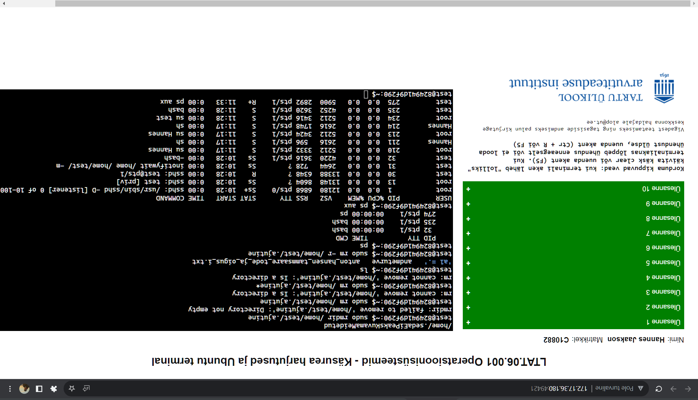

#Unixi käsurida

Tänases (20.09.2023) opsys praktikumis installeerisin virtuaalmasinasse ubuntu ning õppisin seda natuke kasutama, peamiselt käis kasutamine terminali kaudu. Olin üllatunud, kui kiiresti ubuntu installeerimine käis, vähemalt võrreldes windowsiga. Terminali kasutamine tahab veel kindalsti harjutamist.

Lisasin siia kuvatõmmise, mis tõestab mu praktikumi läbitust.

